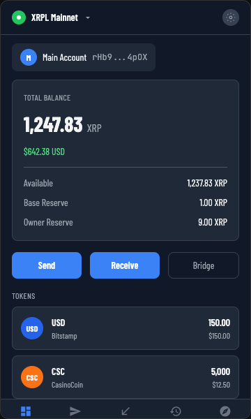
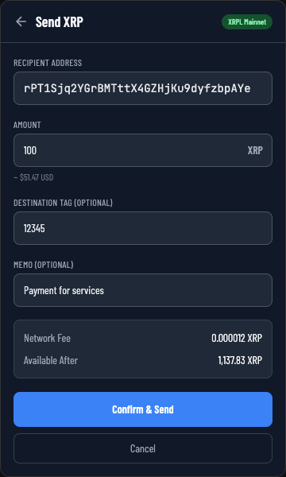
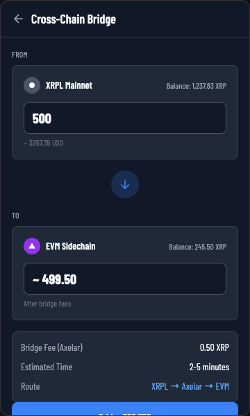
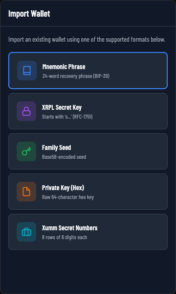
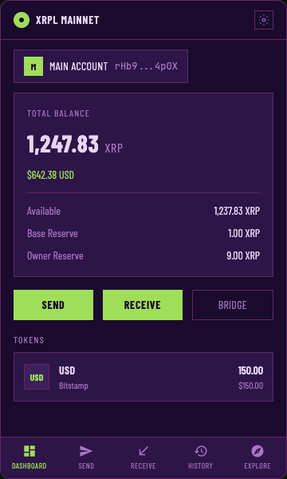

# Otsu Wallet

A secure, open-source browser extension wallet for the XRP Ledger and XRPL EVM Sidechain.

<p align="center">
  
  
  
</p>

## Features

**Multi-Chain Support**
- XRP Ledger (Mainnet & Testnet)
- XRPL EVM Sidechain (Mainnet & Testnet)
- Cross-chain bridge via Axelar

**Wallet Management**
- Create new wallets with 24-word mnemonic (BIP-39)
- Import existing wallets (mnemonic, secret key, family seed, hex private key, Xumm secret numbers)
- Manage multiple accounts from a single wallet
- Export mnemonic for backup

**Token & NFT Operations**
- View balances with USD valuations (DEX price quotes)
- Send and receive XRP, issued tokens, and ERC-20 tokens
- Trustline management for XRPL tokens
- NFT gallery with IPFS metadata resolution
- Escrow and check tracking

**Transaction History**
- Full transaction history with pagination
- Detailed transaction view with memo support
- Bridge transaction status tracking

**dApp Integration**
- Standard XRPL provider API
- EIP-1193 compatible EVM provider
- Granular permission scopes (read, sign, submit, network switching)
- Connected dApp management

<p align="center">
  
  
</p>

## Security

- **Local-only encryption** -- All private keys encrypted with AES-GCM + PBKDF2 (600,000 iterations)
- **Zero data collection** -- No analytics, no telemetry, no external servers
- **Manifest V3** -- Minimal permission footprint (storage, alarms, tabs)
- **Open source** -- Verify the code yourself

See [Privacy Policy](PRIVACY.md) for details.

## Themes

Otsu Wallet ships with 4 themes:
- Light
- Dark
- System (follows OS preference)
- **EVA-01** -- Evangelion-inspired theme with lime/purple palette and angular design

## Architecture

Monorepo with [pnpm](https://pnpm.io/) workspaces:

| Package | Description |
|---|---|
| `@otsu/types` | Shared TypeScript interfaces |
| `@otsu/constants` | Network definitions, reserves, derivation paths |
| `@otsu/core` | Framework-agnostic services (keyring, network, auth, transactions, tokens) |
| `@otsu/extension` | Browser extension (Vue 3 + Vite 6 + Tailwind CSS 3) |
| `@otsu/api` | Provider API types + OtsuWallet class for dApp integration |
| `@otsu/eslint-config` | Shared ESLint configuration |

## Tech Stack

- **Frontend**: Vue 3, TypeScript, Tailwind CSS 3
- **Build**: Vite 6, pnpm workspaces
- **XRPL**: xrpl.js v4
- **EVM**: ethers.js v6
- **Bridge**: Axelar SDK
- **Testing**: Vitest (400+ tests)
- **Extension**: Manifest V3 (Chrome + Firefox)

## Getting Started

### Prerequisites

- Node.js >= 20.11
- pnpm >= 10

### Install & Build

```bash
# Install dependencies
pnpm install

# Run tests
pnpm test

# Type check
pnpm typecheck

# Build Chrome extension
pnpm --filter @otsu/extension build:chrome

# Build Firefox extension
pnpm --filter @otsu/extension build:firefox

# Build both
pnpm --filter @otsu/extension build:all
```

### Load in Browser

**Chrome:**
1. Navigate to `chrome://extensions`
2. Enable "Developer mode"
3. Click "Load unpacked"
4. Select `packages/extension/dist`

**Firefox:**
1. Navigate to `about:debugging#/runtime/this-firefox`
2. Click "Load Temporary Add-on"
3. Select `packages/extension/dist/manifest.json`

### Development

```bash
# Watch mode (rebuilds on changes)
pnpm --filter @otsu/extension dev
```

## Scripts

| Command | Description |
|---|---|
| `pnpm test` | Run all tests |
| `pnpm test:watch` | Run tests in watch mode |
| `pnpm test:coverage` | Run tests with coverage |
| `pnpm typecheck` | Type check all packages |
| `pnpm lint` | Lint all packages |
| `pnpm format` | Format code with Prettier |
| `pnpm format:check` | Check formatting |

## Packaging & Release

```bash
# Package Chrome extension (creates .zip)
pnpm --filter @otsu/extension package:chrome

# Package Firefox extension (creates .zip + source .zip)
pnpm --filter @otsu/extension package:firefox
```

Releases are automated via GitHub Actions. Pushing a `v*` tag triggers:
1. Typecheck + tests
2. Chrome and Firefox packaging
3. GitHub Release with attached zips
4. Automated submission to Chrome Web Store and Firefox Add-ons

## Supported Networks

| Network | Type | Chain ID |
|---|---|---|
| XRPL Mainnet | XRPL | -- |
| XRPL Testnet | XRPL | -- |
| XRPL EVM Sidechain Mainnet | EVM | 1440002 |
| XRPL EVM Sidechain Testnet | EVM | 1449000 |

## Contributing

1. Fork the repository
2. Create a feature branch (`git checkout -b feature/my-feature`)
3. Make your changes
4. Run tests (`pnpm test`) and type check (`pnpm typecheck`)
5. Commit using conventional commits (`feat:`, `fix:`, `refactor:`, etc.)
6. Open a pull request

## License

[MIT](LICENSE) -- romthpt
